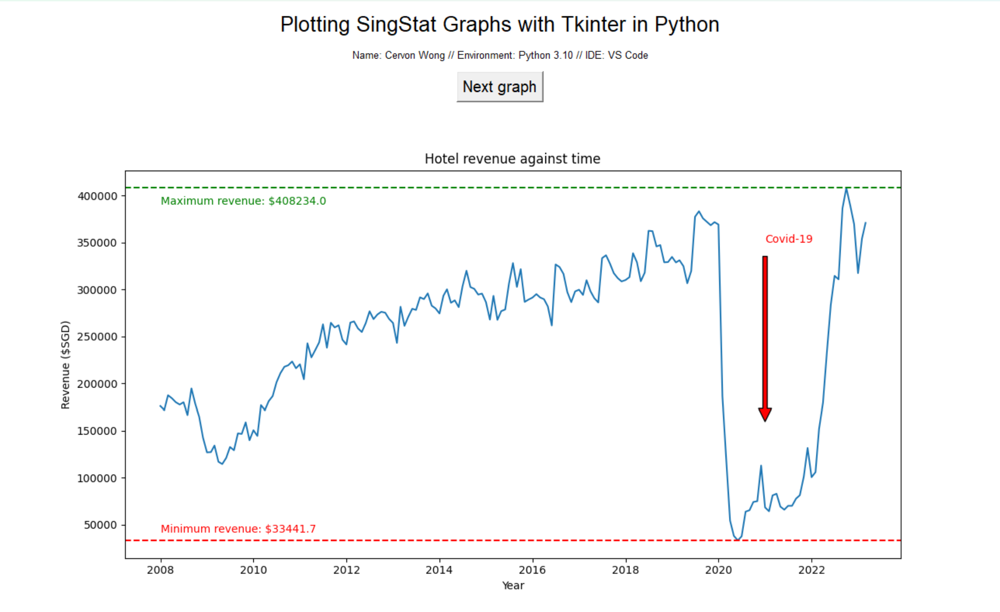

# NuSpace internship assignment
Name: Cervon Wong

## Setting up
Python version used: 3.10
IDE used: VSCode
OS used: Windows

1. Install Python if your system does not have it installed. For Windows, [install the latest version here](https://www.python.org/downloads/).
1. Download this repository and save the folder to a convenient location.
1. Open a terminal and run `pip install matplotlib`, `pip install tk`, and `pip install pandas` to download dependencies for plotting graphs using pip.
1. Navigate to the folder containing the code files and run `python3 GUI.py`.
1. A window should appear with plotted graphs.

## Data
All data retrieved from [SingStat](https://www.singstat.gov.sg/), and analysed with accordance to the [Singapore Open Data License](https://data.gov.sg/open-data-licence)